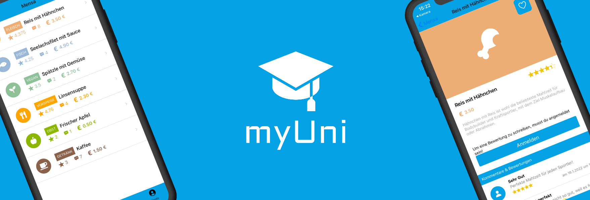

<!--
Hey, thanks for using the awesome-readme-template template.  
If you have any enhancements, then fork this project and create a pull request 
or just open an issue with the label "enhancement".
Don't forget to give this project a star for additional support ;)
Maybe you can mention me or this repo in the acknowledgements too
-->
<div align="center">
  
</div>

<br />

<!-- Table of Contents -->
# :notebook_with_decorative_cover: Table of Contents

- [About the Project](#star2-about-the-project)
  * [Tech Stack](#space_invader-tech-stack)
  * [Features](#dart-features)
  * [Color Reference](#art-color-reference)
  * [Environment Variables](#key-environment-variables)
- [Getting Started](#toolbox-getting-started)
  * [Prerequisites](#bangbang-prerequisites)
  * [Installation](#gear-installation)
  * [Running Tests](#test_tube-running-tests)
  * [Run Locally](#running-run-locally)
  * [Deployment](#triangular_flag_on_post-deployment)
- [Usage](#eyes-usage)
- [Roadmap](#compass-roadmap)
- [Contributing](#wave-contributing)
  * [Code of Conduct](#scroll-code-of-conduct)
- [FAQ](#grey_question-faq)
- [Contact](#handshake-contact)

  

<!-- About the Project -->
## :star2: About the Project

<!-- TechStack -->
### :space_invader: Tech Stack

<details>
  <summary>Client & Server</summary>
  <ul>
    <li><a href="https://www.typescriptlang.org/">JavaScript</a></li>
    <li><a href="https://reactjs.org/">React.js</a></li>
  </ul>
</details>

<details>
<summary>Database</summary>
  <ul>
    <li><a href="https://www.mysql.com/">Firebase</a></li>
  </ul>
</details>

<!-- Features -->
### :dart: Features

- Create an Event
- Participate an Event
- Get geo local data from the event (API for Google Maps / Apple Maps)
- more coming


<!-- Getting Started -->
## 	:toolbox: Getting Started

<!-- Prerequisites -->
### :bangbang: Prerequisites

This project uses npm as package manager

```bash
 npm install --global
```

<!-- Installation -->
### :gear: Installation

Install my-project with npm

```bash
  npm install myUni
  cd myUni
```

<!-- Run Locally -->
### :running: Run Locally

Clone the project

```bash
  git clone https://github.com/yusufkara95/myUni.git
```

Go to the project directory

```bash
  cd myUni
```

Install dependencies

```bash
  npm install
```

Start the server

```bash
  npm/expo start
```


<!-- Deployment -->
### :triangular_flag_on_post: Deployment

To deploy this project run

```bash
  yarn deploy
```


<!-- Contributing -->
## :wave: Contributing

Contributions are always welcome!


<!-- Contact -->
## :handshake: Contact

Yusuf Kara - instagram.com/yugamuga

Project Link: [https://github.com/yusufkara95/myUni](https://github.com/yusufkara95/myUni)

